# Tasks for Create Repo Account v2

## Overview
This document tracks the development of the `create_repo_account_v2.sh` script, which enables associating GitHub SSH accounts with specific repositories for multi-account management. It builds on the existing enhanced SSH setup system.

Current time: 2025-09-29T10:01:35Z (UTC+5:30)

## Completed Tasks
- [x] Initialized task tracking file (2025-09-29T10:00:17Z)
- [x] Reviewed `setup/setup_ssh_enhanced_v2.sh` for core SSH account setup logic (2025-09-29T10:00:17Z)
- [x] Reviewed `docs/ARCHITECTURE.md` for account schema and security features (2025-09-29T10:00:17Z)
- [x] Reviewed `docs/README.md` for project features and usage (2025-09-29T10:00:17Z)
- [x] Reviewed `docs/TASKS.md` for existing project roadmap (2025-09-29T10:00:17Z)
- [x] Reviewed `utils/config_manager.sh` for JSON account management (2025-09-29T10:00:17Z)
- [x] Reviewed templates folder (.git-account, accounts.json, ssh_config_github) for configuration templates (2025-09-29T10:01:08Z)
- [x] Reviewed utils folder (repair_accounts.sh, validate_setup_v2.sh, verify_account.sh, spinner.sh, spinners.json) for utility functions (2025-09-29T10:01:15Z)
- [x] Analyzed existing `repo/create_repo_account.sh` (v1 behavior) (2025-09-29T10:01:08Z)
- [x] Created initial todo list for implementation steps (2025-09-29T10:01:35Z)

## Implementation Plan for create_repo_account_v2.sh

### High-Level Overview
The script will enhance the v1 version by adding a rich TUI for account selection (supporting numbers, arrows/tab for navigation), confirmation prompts, manual repo URL input if needed, and comprehensive verification. It will be jq-free like v2 scripts, using grep/sed for JSON parsing. Colors, emojis, and spinners will be sourced from utils/ for a polished UX.

Key improvements over v1:
- Arrow key/tab navigation in menu (using a bash loop with read -n1 for key detection).
- Spinner during git operations.
- Prompt for remote repo URL if not set.
- Overwrite confirmation for existing .git-account.
- Full verification suite: fetch, log, branches.
- Edge case handling: no accounts, non-git dir, invalid selections.

Estimated script length: ~200-300 lines. Compatible with macOS (zsh/bash).

### Script Structure
1. **Initialization (Lines 1-50)**:
   - Shebang: `#!/bin/bash`
   - Source utils: colors/emojis from setup_ssh_enhanced_v2.sh style; spinner from utils/external/spinner.sh.
   - Paths: GITHUB_DIR="$HOME/.ssh/github", ACCOUNTS_JSON="$GITHUB_DIR/accounts.json"
   - Detect current dir: `REPO_DIR="${PWD}"` (allow manual override via arg: `./script.sh /path/to/repo`).
   - Check if git repo: `git rev-parse --is-inside-work-tree` || init/warn.

2. **Account Discovery (Lines 50-80)**:
   - jq-free list: Adapt `json_list_accounts` from validate_setup_v2.sh to get account names and emails.
   - If no accounts: Error with emoji ❌, suggest running setup_ssh_enhanced_v2.sh.
   - Format list: Numbered with colors, e.g., "1️⃣ work (user@company.com)"

3. **TUI Selection (Lines 80-150)**:
   - Use bash select for base, but enhance with arrow/tab support:
     - Display menu with highlighted selection (use tput for cursor positioning).
     - Loop: `read -n1 -s key` to detect ↑↓ (A/B escape seq), Tab (09), Enter (10), numbers (0-9).
     - Highlight current selection with colors (e.g., GREEN for selected).
     - Spinner during display if needed.
   - Confirmation: "Associate 'work' with this repo? (y/n)" with emoji ✅/❌.

4. **Configuration (Lines 150-200)**:
   - If .git-account exists: Prompt overwrite (y/n).
   - Prompt for remote URL if no origin: "Enter repo URL (e.g., git@github-work:user/repo.git): "
     - Validate format, suggest host alias based on account (e.g., github-$account).
   - Write .git-account template:
     ```
     # GitHub Account Configuration
     ACCOUNT_ALIAS="work"
     GIT_NAME="Work Account"  # From prompt or default
     GIT_EMAIL="user@company.com"  # From accounts.json
     REMOTE_REPO="git@github-work:user/repo.git"
     SSH_HOST_ALIAS="github-work"
     # Generated on: $(date)
     ```
   - Set local git config: `git config user.name "$GIT_NAME"`, `git config user.email "$GIT_EMAIL"`
   - Add remote if needed: `git remote add origin "$REMOTE_REPO"` or update if exists.
   - Add to .gitignore: `echo ".git-account" >> .gitignore` (check if exists first).

5. **Verification (Lines 200-250)**:
   - Spinner: "Verifying setup..." during each step.
   - SSH test: Adapt verify_account.sh: `ssh -T git@"$SSH_HOST_ALIAS" | grep success`
   - Git fetch: `git fetch origin` (handle errors).
   - Git log: `git log --oneline -5` (show prev commits or "No commits yet").
   - Git branches: `git branch -a` (list local/remote).
   - Success message with 🎉 if all pass.

6. **Error Handling & UX (Throughout)**:
   - Colors: RED for errors, GREEN for success, YELLOW for warnings.
   - Emojis: 🚀 start, 🔑 account, 📁 repo, ✅ checks, ❌ fails.
   - Spinners: Use "dots" or "shark" from spinners.json during waits (e.g., fetch).
   - Cleanup: Remove temps, restore cursor.

### Workflow Diagram

```mermaid
graph TD
    A[Start: Detect Repo Dir] --> B{Is Git Repo?}
    B -->|No| C[Init Git or Warn]
    B -->|Yes| D[List Accounts from JSON]
    D --> E{Accounts Exist?}
    E -->|No| F[Error: Run Setup Script]
    E -->|Yes| G[TUI: Select Account w/ Arrows/Tab/Numbers]
    G --> H[Confirm Selection]
    H --> I{Prompt Remote URL?}
    I -->|Yes| J[Input & Validate URL]
    I -->|No| K[Use Existing]
    J --> K
    K --> L{.git-account Exists?}
    L -->|Yes| M[Overwrite?]
    M -->|No| N[Exit]
    M -->|Yes| O[Write Config]
    L -->|No| O
    O --> P[Set Git Config Local]
    P --> Q[Add/Update Remote Origin]
    Q --> R[Add to .gitignore]
    R --> S[Verify: SSH + Fetch + Log + Branches]
    S --> T[Success: 🎉 Complete]
    F --> U[End]
    N --> U
    T --> U
```


### Dependencies & Integration
- Reuse: JSON parsing from validate_setup_v2.sh, spinner from external/spinner.sh.
- No new deps: Pure bash, grep/sed/awk.
- Testing: Run in sample repo, verify .git-account, git config, remote.
- Cross-platform: Focus macOS, note Windows .ps1 later.

### Timeline
- Planning: Complete (2025-09-29T10:01:35Z)
- Implementation: Switch to code mode (next)
- Testing: Post-code
- Docs Update: Add to README.md/TASKS.md

## Current Tasks
- [-] Create detailed implementation plan (2025-09-29T10:01:35Z)

## Future Tasks
- [ ] Implement script in code mode (Estimated: 2025-09-29T10:30:00Z)
- [ ] Add error handling for edge cases (e.g., no accounts configured, invalid repo) (Estimated: Post-implementation)
- [ ] Integrate with MCP tools if needed for advanced features (e.g., dynamic account resolution)
- [ ] Update docs/README.md and ARCHITECTURE.md with new feature details (Estimated: Post-completion)
- [ ] Perform cross-platform testing (macOS, Linux, Windows via .ps1 equivalent)
- [ ] Add to project roadmap in docs/TASKS.md (Estimated: Completion review)