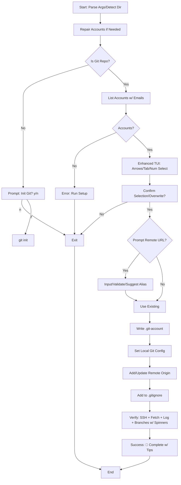

# Tasks for Create Repo Account v3

## Overview
This document tracks the development of the `create_repo_account_v3.sh` script, which enhances repo account association for multi-account GitHub SSH management. It builds on the existing v2 script (which focuses on cloning and basic setup) by emphasizing association for existing directories/repos, adding advanced TUI (arrow/tab/number selection), robust confirmation, and comprehensive verification (fetch, log, branches). The v2 script already handles .git-account creation, git config, gitignore, and basic SSH tests, but v3 will refine for non-clone use cases, improve UX, and add missing verifications.

Current time: 2025-09-29T10:12:17Z (UTC+5:30)

## Completed Tasks
- [x] Initialized task tracking file (renamed to v3) (2025-09-29T10:12:17Z)
- [x] Reviewed `setup/setup_ssh_enhanced_v2.sh` for core SSH account setup logic (2025-09-29T10:00:17Z)
- [x] Reviewed `docs/ARCHITECTURE.md` for account schema and security features (2025-09-29T10:00:17Z)
- [x] Reviewed `docs/README.md` for project features and usage (2025-09-29T10:00:17Z)
- [x] Reviewed `docs/TASKS.md` for existing project roadmap (2025-09-29T10:00:17Z)
- [x] Reviewed `utils/config_manager.sh` for JSON account management (2025-09-29T10:00:17Z)
- [x] Reviewed templates folder (.git-account, accounts.json, ssh_config_github) for configuration templates (2025-09-29T10:01:08Z)
- [x] Reviewed utils folder (repair_accounts.sh, validate_setup_v2.sh, verify_account.sh, spinner.sh, spinners.json) for utility functions (2025-09-29T10:01:15Z)
- [x] Analyzed existing `repo/create_repo_account.sh` (v1 behavior) (2025-09-29T10:01:08Z)
- [x] Reviewed `repo/create_repo_account_v2.sh` for existing v2 implementation (cloning, selection, config) (2025-09-29T10:09:27Z)
- [x] Created initial todo list for implementation steps (2025-09-29T10:01:35Z)
- [x] Created detailed v2 plan (now superseded by v3) (2025-09-29T10:01:35Z)

## Implementation Plan for create_repo_account_v3.sh

### High-Level Overview
v3 refines v2 by focusing on associating accounts to existing repos/directories (current dir by default, manual path option). It retains v2's strengths (jq-free JSON, spinners, colors/emojis, repair integration) but adds:
- Advanced TUI: Numbered menu + arrow key/tab navigation (build on v2's simple numbered select using escape sequences for keys).
- Explicit confirmation for selections/overwrites.
- Optional remote URL prompt/update (if no origin or mismatch).
- Full verification: SSH test (from v2), plus git fetch, log (prev commits), branches.
- Edge cases: Non-git dir (offer init), no accounts (repair/suggest setup), invalid inputs.
- UX: Spinners during ops, emojis/colors, no cloning by default (optional flag: `--clone <url>`).

No jq dep, pure bash. Builds on v2's functions (e.g., json_list_accounts, write_git_account_config). Script length: ~250-350 lines. macOS focus.

Larger project goal: Seamless multi-account GitHub workflow. v3 completes per-repo association, enabling isolated configs without global changes. Nothing major forgotten; v3 covers user reqs (TUI selection/confirm, .git-account/git config/remote, gitignore, verification). Optional: Add `--list` to show current association.

### Script Structure
1. **Initialization (Lines 1-60)**:
   - Shebang: `#!/bin/bash`
   - Source: Colors/emojis from v2; spinner.sh (with fallback).
   - Paths: GITHUB_DIR, ACCOUNTS_JSON.
   - Args: Optional repo path (`$1`), flags (`--clone <url>` for v2-like clone).
   - Detect dir: `REPO_DIR="${1:-$(pwd)}"`. Validate exists.
   - Repair: Call `repair_accounts_if_needed` from v2.
   - Check git: `cd "$REPO_DIR" && git rev-parse --is-inside-work-tree` || prompt init.

2. **Account Discovery (Lines 60-90)**:
   - Use v2's `json_list_accounts` + `json_get_account_email` for list with emails.
   - If empty: Run repair (v2 style), still empty? Error + suggest setup_ssh_enhanced_v2.sh.
   - Format: Numbered colored list, e.g., "1️⃣ work (user@company.com) 🔑"

3. **Enhanced TUI Selection (Lines 90-160)**:
   - Build on v2's `interactive_account_select`: Add arrow/tab support.
     - Display menu with cursor (tput cup for positioning).
     - Loop: `read -n1 -s key` for keys: ↑/↓ (esc [A/[B), Tab (09), numbers, Enter.
     - Highlight selected (v2's SELECTED_BG/FG).
     - If existing .git-account (v2's find_git_account_file): Show current, offer switch/overwrite.
   - Confirmation: "Associate 'work' (user@company.com) to $(pwd)? [y/n]" with spinner if needed.
   - Fallback: v2's numbered input if key detection fails (macOS term compat).

4. **Configuration (Lines 160-220)**:
   - If .git-account exists (v2 style): Confirm overwrite (y/n/abort).
   - Remote handling: If no origin (`git remote get-url origin`), prompt URL.
     - Suggest: "git@github-$account:user/repo.git" (parse if HTTPS input).
     - Validate: Basic regex for git URL, test SSH if github.
     - Add/update: `git remote add/set-url origin "$URL"`.
   - Write .git-account: Use v2's `write_git_account_config` (add REMOTE_REPO field).
   - Git config: Local `git config user.name/email` (from account).
   - Gitignore: v2's `ensure_gitignore_has_git_account`.

5. **Verification (Lines 220-280)**:
   - Spinner: "Verifying..." (dots/shark).
   - SSH: v2's test (`ssh -T git@github-$account` grep success).
   - Fetch: `git fetch origin` (handle empty repo).
   - Log: `git log --oneline -n5` or "No commits" if empty.
   - Branches: `git branch -a` (list local/remote).
   - Report: GREEN ✅ per pass, RED ❌ fails with tips (e.g., "Run git pull" if fetch fails).

6. **Error Handling & UX (Throughout)**:
   - Traps: Cleanup temps, restore cursor.
   - Colors/Emojis: Extend v2 (e.g., 🚀 start, 📋 config, 🔍 verify).
   - Spinners: v2's run_with_spinner for ops (e.g., fetch).
   - Optional clone: If `--clone <url>`, fallback to v2 clone logic post-association.

### Workflow Diagram

### Dependencies & Integration
- Reuse v2: JSON funcs, write_git_account_config, repair, spinners (star2/arrow3).
- New: Key detection loop for TUI (handle esc seq: read -t0.1 for multi-char).
- Testing: Existing repo (current dir), new dir (init), URL prompt, overwrite.
- Cross-platform: macOS primary; note term key detection may vary.

### Timeline & Larger Goal Check
- Planning: Complete (2025-09-29T10:12:17Z)
- Implementation: Switch to code (next)
- Testing: Post-code
- Docs: Update README/TASKS.md w/ v3.
Larger goal: v3 finalizes per-repo isolation, enabling safe multi-account pushes/pulls. Script covers all: TUI/confirm, config/remote, gitignore, verify. No major gaps; optional future: Auto-detect repo from URL/path.

## Current Tasks
- [-] Create detailed implementation plan (2025-09-29T10:12:17Z)

## Future Tasks
- [ ] Implement script in code mode (Estimated: 2025-09-29T10:30:00Z)
- [ ] Add error handling for edge cases (e.g., no accounts, invalid repo/URL) (Estimated: Post-implementation)
- [ ] Integrate with MCP tools if needed (e.g., dynamic resolution)
- [ ] Update docs/README.md and ARCHITECTURE.md with v3 details (Estimated: Post-completion)
- [ ] Cross-platform testing (macOS/Linux/Windows .ps1)
- [ ] Add to project roadmap in docs/TASKS.md (Estimated: Completion)